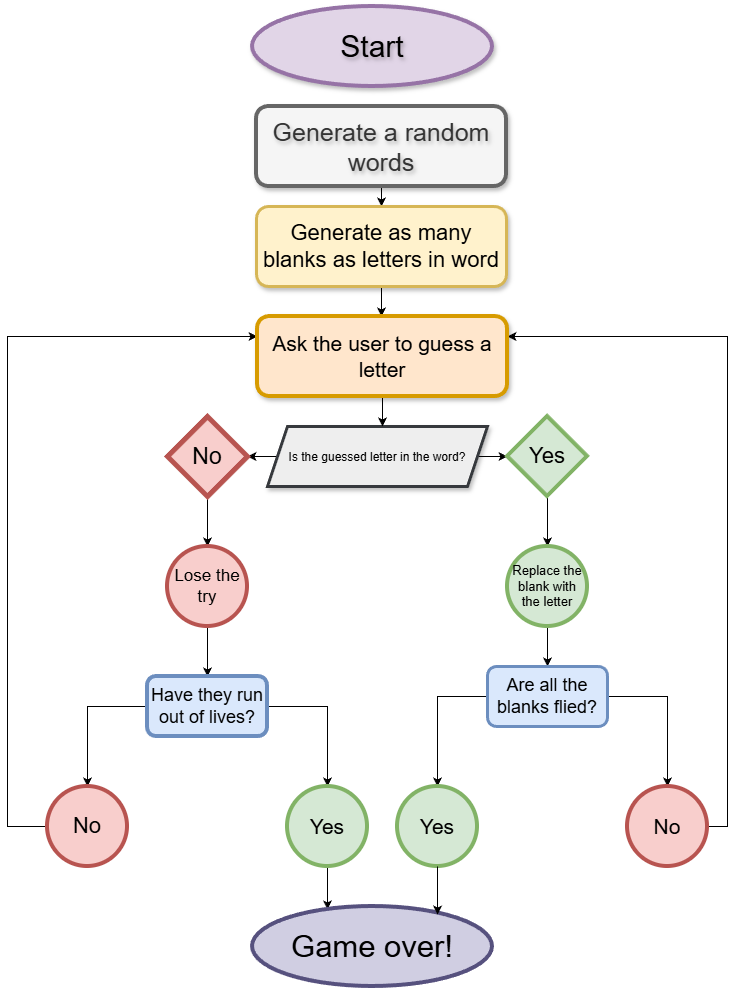

# Hangman Game  

A simple and interactive Python word-guessing game where the player attempts to uncover the hidden word before running out of lives.  
The game progressively reveals correct letters, tracks incorrect guesses intelligently, and selects words randomly to ensure a new challenge each time.

---------------------

## Features  
- Random word selection  
- Progressive letter revealing  
- Tracks incorrect attempts  
- Terminal-based gameplay  
- Simple and clean Python implementation  

----------------------

## How to Run  
1. Install Python (version 3.8 or later).  
2. Download or clone the repository.  
3. Run the game with the following command:  

```bash
python Hangman_game!.py
